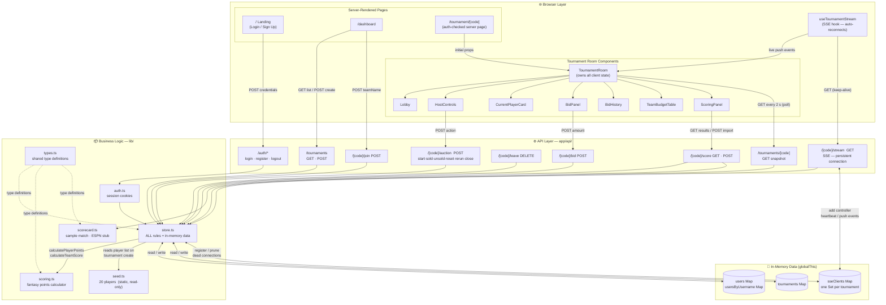
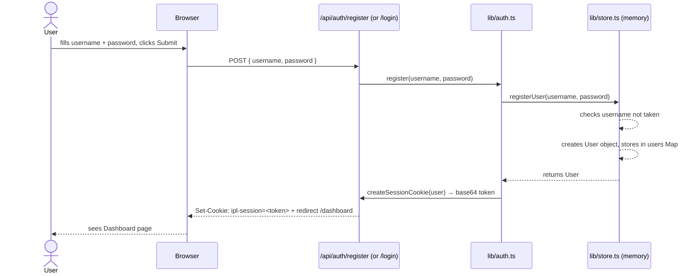
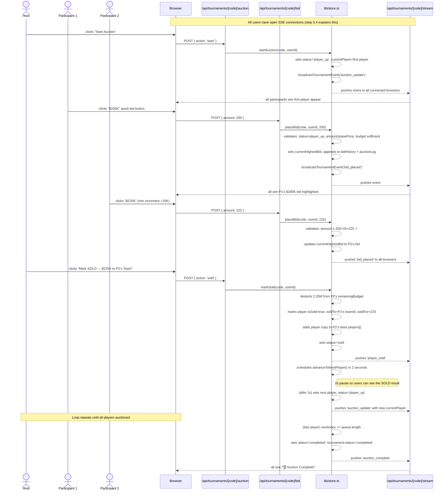
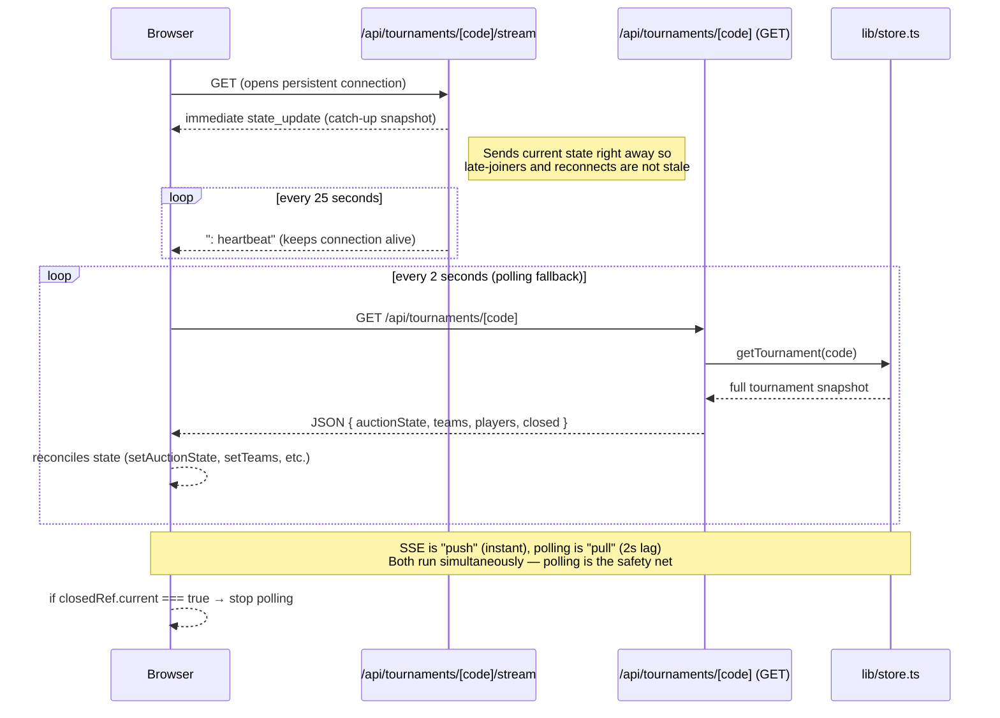
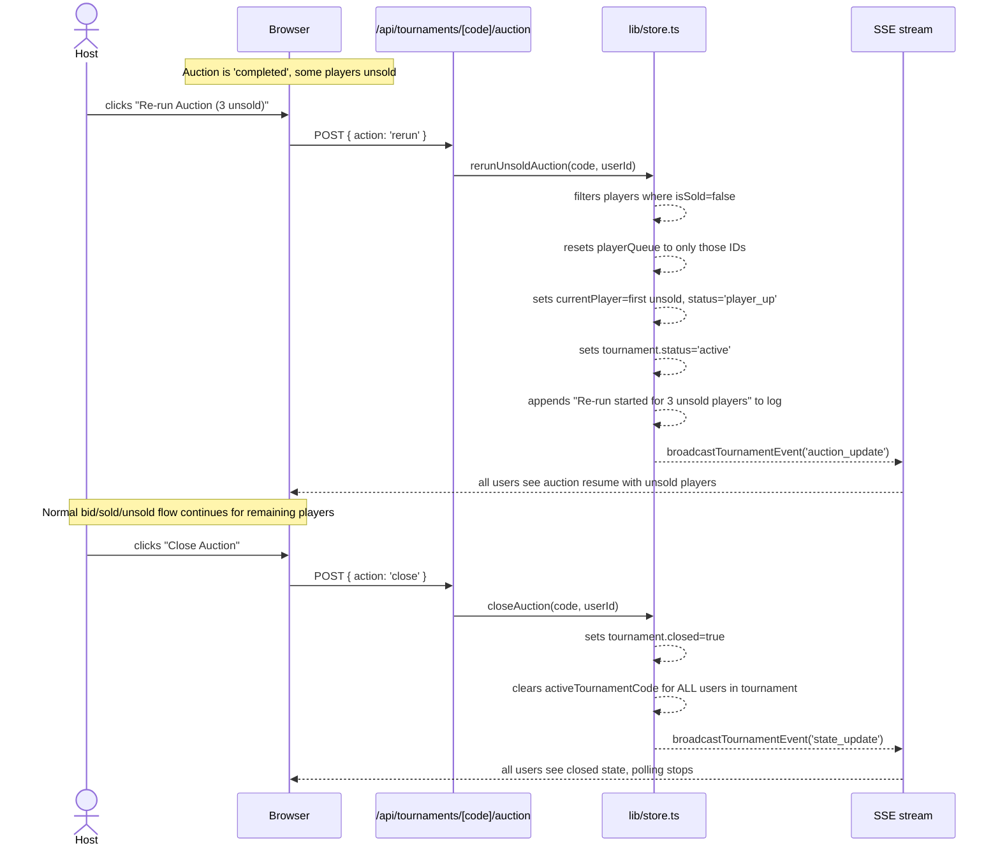
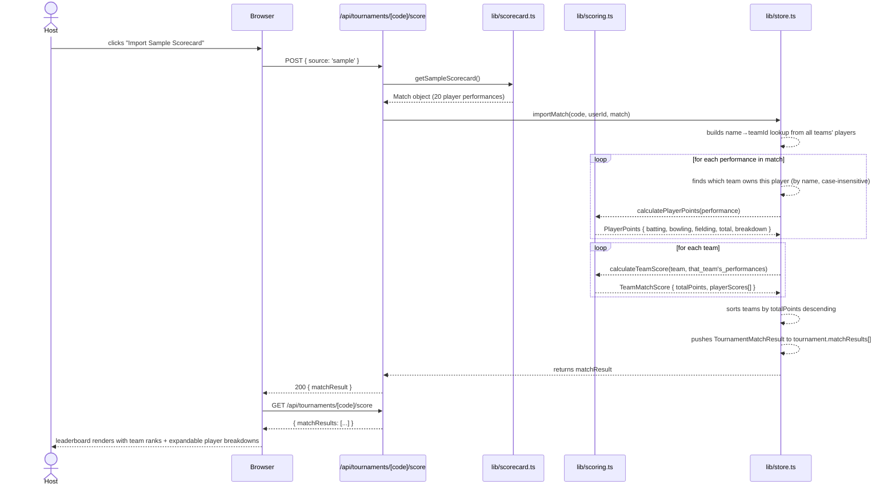

# IPL Auction POC — Architecture & Design

---

## Table of Contents

1. [What This App Does (Plain English)](#1-what-this-app-does-plain-english)
2. [The Big Picture — How the Pieces Fit](#2-the-big-picture--how-the-pieces-fit)
3. [Technology Choices and Why](#3-technology-choices-and-why)
4. [The Data Model — What the App Remembers](#4-the-data-model--what-the-app-remembers)
5. [How Data Moves — Sequence Diagrams](#5-how-data-moves--sequence-diagrams)
6. [Every Function, Explained](#6-every-function-explained)
7. [The Real-Time System — How Everyone Stays in Sync](#7-the-real-time-system--how-everyone-stays-in-sync)
8. [Security — What's There and What's Missing](#8-security--whats-there-and-whats-missing)
9. [Sections That Show Signs of AI Authorship](#9-sections-that-show-signs-of-ai-authorship)

---

## 1. What This App Does (Plain English)

Imagine an IPL cricket auction happening between friends over the internet. One person — the **host** — runs the auction. A number of other people — the **participants** — each represent a team and compete to buy cricket players by bidding with a fixed budget.

This application does exactly that:

- Anyone can sign up, create a tournament (auction room), and invite friends using a short code like `IPL-4X9K`.
- Friends join using that code, each picking a team name.
- The host starts the auction. Players come up one by one. Everyone bids. The host decides who wins.
- After the auction, the host can re-run a second round for players nobody wanted.
- Once all rounds are done, the host closes the auction.
- As a bonus feature, the host can import a cricket match scorecard. The app then awards fantasy points to each team based on how their bought players performed in that match, and shows a leaderboard.

Everything happens live — if one person places a bid, everyone else sees it within 2 seconds.

---

## 2. The Big Picture — How the Pieces Fit

The application is structured in three broad layers. Think of it like a restaurant: the **browser** is the dining room (what users see), the **API routes** are the pass-through counter (receive orders, relay them), and **lib/** is the kitchen (where all the actual work happens). There is **no database** — all data lives in the server's memory (RAM) and disappears on restart. This is intentional for a POC.

The block diagram below shows every component, which layer it lives in, and how data flows between them. Solid arrows are HTTP calls; dashed arrows are type-sharing (no runtime cost).



### File Map

```
ipl-auction-poc/
│
├── app/                         ← Pages and API endpoints (Next.js routing)
│   ├── page.tsx                 ← Landing page: login / sign-up
│   ├── dashboard/page.tsx       ← Dashboard: create, join, list tournaments
│   ├── tournament/[code]/       ← The live auction room
│   │   └── page.tsx
│   └── api/
│       ├── auth/                ← Login, register, logout
│       ├── players/             ← List all players
│       └── tournaments/
│           ├── route.ts         ← Create / list tournaments
│           └── [code]/
│               ├── route.ts     ← Get a single tournament
│               ├── join/        ← Join a tournament
│               ├── leave/       ← Leave a tournament
│               ├── bid/         ← Place a bid
│               ├── auction/     ← Host controls (start, sold, unsold, …)
│               ├── stream/      ← Live event feed (SSE)
│               └── score/       ← Import + fetch match scores
│
├── lib/
│   ├── types.ts                 ← All data shape definitions
│   ├── auth.ts                  ← Login / session cookie helpers
│   ├── store.ts                 ← ALL business logic + in-memory data
│   ├── scoring.ts               ← Fantasy points calculator
│   ├── scorecard.ts             ← Sample match data + ESPN stub
│   └── seed.ts                  ← The 20 pre-loaded cricket players
│
├── hooks/
│   └── useTournamentStream.ts   ← Browser hook that listens for live events
│
└── components/
    ├── ui/                      ← Generic building blocks (Card, Button, Badge)
    ├── auth/                    ← Login and sign-up forms
    ├── layout/                  ← Header bar
    ├── dashboard/               ← Tournament cards and creation forms
    └── tournament/              ← Everything inside the auction room
```

---

## 3. Technology Choices and Why

| Choice | What it is | Why it was picked |
|--------|-----------|-------------------|
| **Next.js 15** | A framework that handles both the website pages and the server API in one project | Simplifies deployment; no separate backend needed |
| **TypeScript** | JavaScript with strict type checking | Catches bugs at write-time, not run-time; especially useful when sharing data shapes between server and browser |
| **In-memory store** | Data lives in Node.js global variables (`globalThis.__store`) | Zero setup — no database to install or configure; acceptable for a POC |
| **SSE (Server-Sent Events)** | A way for the server to push updates to the browser over a persistent connection | Simpler than WebSockets; one-directional (server → browser) is all that's needed for live auction updates |
| **Tailwind CSS** | A utility-first CSS framework | Fast styling without writing separate CSS files |
| **No Redux / Zustand** | No dedicated state management library | The data model is simple enough that React's built-in `useState` suffices, with the server as the single source of truth |

### A Note on the Global Store

The choice to store everything in `globalThis.__store` (a Node.js global variable) is the single most important architectural decision to understand. In development with Next.js, the server stays alive between requests, so this works perfectly. In production, if you have multiple server instances, each would have its own separate copy of `__store` and they would not share data. This is the primary reason the app is labelled a POC.

---

## 4. The Data Model — What the App Remembers

Think of the data model as the filing system. Here are the "folders":

### User
```
Who:    Someone who has signed up
Has:    id, username, password, activeTournamentCode
Key:    activeTournamentCode — prevents joining two tournaments at once
```

### Player (seed data — never changes)
```
Who:    A cricket player (Virat Kohli, Jasprit Bumrah, etc.)
Has:    id, name, role, nationality, basePrice
Source: lib/seed.ts — 20 players hardcoded at startup
```

### TournamentPlayer (a Player + auction outcome)
```
Who:    A player as they exist inside one specific tournament
Extends: Player, plus isSold, soldTo (teamId), soldFor (price)
Lives:  Inside each tournament's players Map
```

### Team
```
Who:    One participant's team in a tournament
Has:    id, teamName, userId, initialBudget, remainingBudget, players[]
Note:   Budget in Millions (M); bids in Thousands (K) — always divide by 100 to convert
```

### Bid
```
Who:    One bid placed by one team for one player
Has:    id, teamId, teamName, userId, playerId, amount, timestamp
Lives:  In auctionState.bidHistory (current player's bids only)
```

### AuctionState
```
Who:    The live state of the auction at any moment
Has:    status, currentPlayerIndex, currentPlayer, currentHighestBid,
        bidHistory, playerQueue, auctionLog
Status values: lobby → player_up → sold/unsold → player_up → … → completed
```

### Tournament
```
Who:    One auction room
Has:    id, code, name, createdBy, status, teamBudget, maxTeams,
        teams (Map), players (Map), auctionState, closed, matchResults[]
The teams and players fields are Maps (key-value stores), not arrays.
These get converted to plain objects before being sent to the browser.
```

### Dependency chain (bottom to top)

```
Player
  └─► TournamentPlayer      (Player + auction outcome)
        └─► Team             (holds TournamentPlayer[])
              └─► Tournament (holds Map<teamId, Team> + Map<playerId, TournamentPlayer>)
                    └─► AuctionState (embedded in Tournament)

User ──────────────────────► activeTournamentCode (points to Tournament.code)
```

---

## 5. How Data Moves — Sequence Diagrams

### 5.1 — Registration and Login



---

### 5.2 — Creating and Joining a Tournament

```mermaid
sequenceDiagram
    actor Host
    actor Participant
    participant Browser
    participant API as /api/tournaments
    participant Store as lib/store.ts

    Host->>Browser: fills "Tournament Name", budget, max teams
    Browser->>API: POST /api/tournaments { name, teamBudget, maxTeams }
    API->>Store: createTournament(userId, name, budget, maxTeams)
    Store-->>Store: generates code e.g. "IPL-4X9K"
    Store-->>Store: copies 20 seeded players into tournament.players Map
    Store-->>Store: creates host's Team, sets user.activeTournamentCode
    Store-->>API: returns Tournament
    API-->>Browser: 201 { tournament }
    Browser-->>Host: redirected to /tournament/IPL-4X9K

    Host->>Participant: shares code "IPL-4X9K" out of band (chat, etc.)

    Participant->>Browser: enters code + team name on Dashboard
    Browser->>API: POST /api/tournaments/IPL-4X9K/join { teamName }
    API->>Store: joinTournament(userId, code, teamName)
    Store-->>Store: validates status='lobby', not full, user not already in
    Store-->>Store: creates Team, sets user.activeTournamentCode
    Store-->>Store: broadcastTournamentEvent('team_joined') → SSE push
    Store-->>API: returns Team
    API-->>Browser: 200 { team }
    Browser-->>Participant: redirected to /tournament/IPL-4X9K
```

---

### 5.3 — Live Auction (The Core Flow)



---

### 5.4 — Real-Time Sync (SSE + Polling Together)



---

### 5.5 — Re-run Unsold Auction



---

### 5.6 — Fantasy Scoring



---

## 6. Every Function, Explained

This section covers every significant function, what it does in plain English, and what other functions it depends on.

---

### `lib/auth.ts`

#### `register(username, password)`
Takes a username and password and creates a new user account. Today it stores the password as plain text — a TODO comment says to swap this for bcrypt hashing before going live.

**Depends on:** `registerUser()` in store.ts

#### `login(username, password)`
Checks if the given credentials match a stored user. Returns the user object if correct, `null` if not.

**Depends on:** `loginUser()` in store.ts

#### `getSession(cookieValue)`
Reads the session cookie from a request and decodes it from base64 back into a `{ userId, username }` object. If the cookie is missing or malformed, returns null. This is called at the start of almost every API route to identify who is making the request.

**Depends on:** Nothing (pure decoding)

#### `createSessionCookie(user)`
Takes a user object and encodes their ID and username into a base64 string that gets stored as a browser cookie. This is the "you are logged in" token.

**Depends on:** Nothing (pure encoding)

---

### `lib/store.ts`

This is the heart of the application. It owns all data and all business rules.

#### `getStore()`
Returns the global in-memory store (creates it on first call). The store contains three Maps: `users`, `usersByUsername`, and `tournaments`. The use of `globalThis` ensures that in Next.js's development mode, where modules can be re-loaded, the data persists across reloads.

**Depends on:** Nothing

#### `getSseClients()`
Returns a Map from tournament code to a Set of SSE stream controllers — one per connected browser tab. Used to push events to all users watching a given tournament.

**Depends on:** Nothing

#### `registerUser(username, passwordHash)`
Saves a new user to the store. Checks for duplicate usernames first (case-insensitive). Generates a UUID for the user ID.

**Depends on:** `getStore()`

#### `loginUser(username, password)`
Looks up a user by username and compares the stored password. Returns the user or null.

**Depends on:** `getStore()`

#### `createTournament(userId, name, teamBudget, maxTeams)`
Creates a new tournament. Generates a unique 4-character code (e.g. `IPL-4X9K`), copies all 20 seeded players into the tournament's player pool, creates the host's team automatically, and marks the host as being in this tournament.

**Depends on:** `getStore()`, `SEEDED_PLAYERS` from seed.ts, `broadcastTournamentEvent()`

#### `joinTournament(userId, code, teamName)`
Adds a participant to an existing tournament. Validates that the tournament is still in the lobby phase (not started), hasn't reached the max team limit, and the user is not already in it. Broadcasts a `team_joined` event so all current participants see the new team appear live.

**Depends on:** `getStore()`, `getTournament()`, `broadcastTournamentEvent()`, `serializeTeams()`

#### `leaveTournament(userId, code)`
Removes a participant from the lobby. Only works while the tournament hasn't started. The host cannot leave (they own the tournament).

**Depends on:** `getStore()`, `getTournament()`, `broadcastTournamentEvent()`, `serializeTeams()`

#### `getTournament(code)`
Simple lookup — returns a tournament by its code, or undefined if not found.

**Depends on:** `getStore()`

#### `listTournaments()`
Returns all tournaments. Used by the dashboard to show what's available.

**Depends on:** `getStore()`

#### `startAuction(code, userId)`
Kicks off the auction. Sets the first player as the current player, changes status from `lobby` to `player_up`, and broadcasts the state to all connected browsers. Requires at least 2 teams — you cannot auction to yourself.

**Depends on:** `getTournament()`, `broadcastTournamentEvent()`, `serializeTeams()`

#### `markSold(code, userId)`
Called by the host when they decide a player has been sold. Deducts the winning bid amount from the winning team's budget (converting from thousands to millions), marks the player as sold, copies the player record into the team's roster, and schedules `advanceToNextPlayer()` to run 2 seconds later. The 2-second delay gives everyone time to see the "SOLD" result before the screen changes.

**Depends on:** `getTournament()`, `advanceToNextPlayer()`, `broadcastTournamentEvent()`, `serializeTeams()`

#### `markUnsold(code, userId)`
Called by the host when a player gets no bids or the host decides to pass. Changes status to `unsold`, logs the result, and schedules `advanceToNextPlayer()` after 2 seconds. The player remains in the tournament's player pool with `isSold = false`.

**Depends on:** `getTournament()`, `advanceToNextPlayer()`, `broadcastTournamentEvent()`, `serializeTeams()`

#### `advanceToNextPlayer(code)` _(internal — not exported)_
This function runs automatically 2 seconds after a player is sold or marked unsold. It increments the index into the player queue. If there are more players, it sets the next one as `currentPlayer` and broadcasts the update. If the queue is exhausted, it sets status to `completed` and broadcasts `auction_complete`. Note: the clearing of `activeTournamentCode` for all users was intentionally removed from this function — it now only happens when the host explicitly calls `closeAuction()`.

**Depends on:** `getTournament()`, `getStore()`, `broadcastTournamentEvent()`, `serializeTeams()`

#### `resetAuction(code, userId)`
Nuclear option — resets everything back to the lobby state. All player sold status is cleared, all teams lose their acquired players and get their budget back, and the queue is rebuilt from the full 20-player seed list.

**Depends on:** `getTournament()`, `SEEDED_PLAYERS`, `broadcastTournamentEvent()`, `serializeTeams()`

#### `rerunUnsoldAuction(code, userId)`
After the auction completes, the host can call this to start a second round with only the players who went unsold. It rebuilds the `playerQueue` to contain only unsold player IDs, resets the auction state, and changes the tournament status back to `active`. It will throw an error if there are no unsold players, if the auction is not yet complete, or if it has already been closed.

**Depends on:** `getTournament()`, `broadcastTournamentEvent()`, `serializeTeams()`

#### `closeAuction(code, userId)`
Permanently closes the auction. Sets `tournament.closed = true` and clears `activeTournamentCode` for every user in the tournament (freeing them to join other tournaments). This is the function that was split out of `advanceToNextPlayer()` — previously the code cleared users' active tournament the moment the queue ran out, which would have prevented re-runs.

**Depends on:** `getTournament()`, `getStore()`, `broadcastTournamentEvent()`, `serializeTeams()`

#### `placeBid(code, userId, amount)`
Validates and records a bid. Checks: the auction is in `player_up` status; the user is a team member; if it's the first bid, the amount meets the player's base price; if there are previous bids, the amount exceeds the current highest bid by at least $25K; and the user is not already the highest bidder. Budget is checked by converting the bid amount from thousands to millions.

**Depends on:** `getTournament()`, `broadcastTournamentEvent()`, `serializeTeams()`

#### `importMatch(code, userId, match)`
Takes a `Match` object (a list of player performances) and computes fantasy points. First builds a lookup from player name to team ID by scanning all teams' rosters. Then for each performance, finds which team owns that player and calculates their points using `calculatePlayerPoints()`. Builds a `TeamMatchScore` for each team, sorts them by total points (highest first), and stores the result in `tournament.matchResults[]`.

**Depends on:** `getTournament()`, `calculatePlayerPoints()` and `calculateTeamScore()` from scoring.ts, `broadcastTournamentEvent()`, `serializeTeams()`

#### `broadcastTournamentEvent(code, event)`
Pushes a JSON event to every browser tab currently watching a tournament. Iterates over all SSE controllers registered for that tournament code. If a controller throws (dead connection), it is removed from the set.

**Depends on:** `getSseClients()`

#### `serializeTeams(tournament)`
Converts the teams Map (which the browser cannot receive directly) into a plain JavaScript object keyed by team ID. This transformation happens every time an event is broadcast.

**Depends on:** Nothing except the tournament object

#### `serializeTournament(tournament)`
Converts an entire tournament (including its teams and players Maps) into a plain object safe to send over HTTP as JSON. The `...tournament` spread means any new fields added to the `Tournament` type are automatically included without needing to update this function.

**Depends on:** `serializeTeams()`

---

### `lib/scoring.ts`

#### `calculatePlayerPoints(perf)`
Takes one player's match performance and translates it into a number. The rules:

| Category | Action | Points |
|----------|--------|--------|
| Batting | Each run scored | +1 |
| Batting | Each four hit | +1 |
| Batting | Each six hit | +2 |
| Batting | Scored 30+ runs | +4 bonus |
| Batting | Scored 50+ runs | +8 more bonus |
| Batting | Scored 100+ runs | +16 more bonus |
| Batting | Got out for zero (duck) | −2 |
| Bowling | Each wicket | +25 |
| Bowling | Each maiden over | +4 |
| Bowling | Took 2+ wickets | +8 bonus |
| Bowling | Took 3+ wickets | +16 more bonus |
| Fielding | Each catch | +8 |
| Fielding | Each stumping | +12 |
| Fielding | Each run-out | +12 |

Returns a `PlayerPoints` object with batting, bowling, fielding subtotals, a grand total, and a human-readable breakdown list like `["Runs: 73 → 73pts", "50+ bonus → 8pts"]`.

**Depends on:** Nothing (pure calculation)

#### `calculateTeamScore(team, performances)`
Takes a team and a list of match performances. For each player the team owns, it searches for a matching performance by name (case-insensitive). Calls `calculatePlayerPoints()` for each match, attaches the team ID, and returns a `TeamMatchScore` with all player scores sorted from highest to lowest.

**Depends on:** `calculatePlayerPoints()`

---

### `lib/scorecard.ts`

#### `getSampleScorecard()`
Returns a hardcoded `Match` object representing a fictional "Stars XI vs Legends XI" game. It covers all 20 seeded players with realistic-looking statistics designed to exercise every scoring rule. Each call generates a fresh UUID for the match ID so multiple imports don't collide.

**Depends on:** Nothing (pure data)

#### `fetchFromESPNCricinfo(_url)`
A placeholder function that immediately throws an error saying the feature is not yet implemented. The parameter name starts with `_` (underscore) to signal that it is intentionally unused. This is a common pattern when the function signature is defined now for future implementation.

**Depends on:** Nothing

---

### `hooks/useTournamentStream.ts`

#### `useTournamentStream({ code, onEvent, enabled })`
A React hook that opens an `EventSource` (SSE) connection to `/api/tournaments/{code}/stream`. When a message arrives, it parses the JSON and calls `onEvent`. If the connection drops (network error, server restart), it waits 3 seconds and reconnects automatically. It avoids a subtle React bug: the `onEvent` callback is stored in a `ref` so the SSE handler always calls the latest version of the callback without needing to restart the connection.

**Depends on:** Browser's built-in `EventSource` API

---

### API Routes (thin wrappers)

Every API route follows the same three-step pattern:
1. Read the session cookie to identify the caller
2. Validate the request body
3. Call a function in `lib/store.ts` and return the result

They contain almost no business logic themselves — that all lives in the store.

| Route | Method | Calls | What it does |
|-------|--------|-------|-------------|
| `/api/auth/register` | POST | `register()` | Creates account, sets cookie |
| `/api/auth/login` | POST | `login()` | Validates login, sets cookie |
| `/api/auth/logout` | POST | — | Clears cookie |
| `/api/tournaments` | GET | `listTournaments()` | Lists all tournaments |
| `/api/tournaments` | POST | `createTournament()` | Creates a new tournament |
| `/api/tournaments/[code]` | GET | `getTournament()` | Returns full tournament state |
| `/api/tournaments/[code]/join` | POST | `joinTournament()` | Adds a team |
| `/api/tournaments/[code]/leave` | DELETE | `leaveTournament()` | Removes a team |
| `/api/tournaments/[code]/bid` | POST | `placeBid()` | Places a bid (validates amount > 0 first) |
| `/api/tournaments/[code]/auction` | POST | `startAuction()` / `markSold()` / `markUnsold()` / `resetAuction()` / `rerunUnsoldAuction()` / `closeAuction()` | Routes `action` field to the right store function |
| `/api/tournaments/[code]/stream` | GET | `getSseClients()` | Opens SSE connection; sends initial state immediately; heartbeat every 25s |
| `/api/tournaments/[code]/score` | GET | `getTournament()` | Returns match results |
| `/api/tournaments/[code]/score` | POST | `getSampleScorecard()` / `fetchFromESPNCricinfo()` / `importMatch()` | Imports and scores a match |
| `/api/players` | GET | `SEEDED_PLAYERS` | Returns the 20-player list |

---

### Components (UI Layer)

Components are responsible for display and user interaction only. They call API routes and update local React state — they never touch the store directly.

| Component | What it shows / does |
|-----------|---------------------|
| `TournamentRoom` | The top-level container. Owns all shared state (teams, auctionState, players, isClosed). Starts the SSE hook and the 2s polling loop. Decides whether to show Lobby, active auction, or completed view. |
| `Lobby` | List of joined teams while waiting to start. |
| `HostControls` | The panel of action buttons the host sees (Start / Mark SOLD / Mark UNSOLD / Reset). Only shown to the host. |
| `CurrentPlayerCard` | Shows the player currently up for bidding — name, role, nationality, base price. |
| `BidPanel` | The bidding interface for participants. Shows quick-bid buttons (min, min+25, min+50, min+100) and a custom input. Prevents bidding if you're already the highest bidder. Hides automatically when no player is up. |
| `BidHistory` | Scrollable list of all bids for the current player. Highlights the current highest bid. |
| `TeamBudgetTable` | Lists all teams with their remaining budget as a progress bar and their acquired players. |
| `AuctionStatusBanner` | Small badge in the top right showing the current phase (Lobby / Bidding Open / Sold / Unsold / Complete). |
| `ScoringPanel` | Fantasy leaderboard. Fetches match results on mount. Host sees import controls. Expandable rows show per-player point breakdowns. |

---

## 7. The Real-Time System — How Everyone Stays in Sync

This is one of the trickier parts of the architecture, so it deserves extra explanation.

### The Problem

When someone bids, everyone else in the room needs to see it immediately — without refreshing the page. How does the server notify all the browsers?

### Solution: SSE (Server-Sent Events)

When any user opens the tournament page, their browser opens a special long-lived HTTP connection to `/api/tournaments/{code}/stream`. This connection stays open indefinitely. Whenever something happens on the server (a bid, a sale, a new player), the server writes a JSON message down this connection to every browser that has one open.

Think of it like a radio broadcast — the server is the radio station, and every connected browser is a receiver.

### The Safety Net: Polling

SSE connections can drop — a browser tab is backgrounded, a laptop sleeps, a Wi-Fi blip. If the SSE drops, users would see stale data until they refresh.

To prevent this, every browser also polls (asks for fresh data) every 2 seconds via a normal HTTP GET request. This runs independently alongside SSE. The SSE keeps things instant; the poll keeps things correct.

Polling stops when:
- `isClosed` becomes `true` (auction permanently closed)

### The `closedRef` Pattern

In `TournamentRoom.tsx`, a `useRef` variable called `closedRef` shadows the `isClosed` state. This is a React pattern to solve a specific timing problem: the `setInterval` polling callback captures the value of `isClosed` at the time it was created (an old value). By reading from `closedRef.current` instead, the callback always sees the latest value.

```
isClosed (state) ──► closedRef.current (always up to date)
                                │
                     polling interval reads this
                     to decide whether to stop
```

### The Catch-Up Snapshot

When a browser first opens the SSE connection (or reconnects after a drop), the server immediately sends the current full state as a `state_update` event. This ensures a late-joining participant or a reconnecting browser doesn't start from nothing — they get fully caught up in the first message.

---

## 8. Security — What's There and What's Missing

The code contains explicit TODO comments acknowledging every security gap. This is intentional and honest POC design.

| Area | Current State | Production Fix |
|------|--------------|----------------|
| Passwords | Stored plaintext | Hash with bcrypt |
| Session cookie | Base64-encoded JSON (trivially decodable) | HMAC-sign with a secret key, or use NextAuth.js |
| Host authorization | Checked: `tournament.createdBy === userId` | Sufficient for this app |
| Budget manipulation | Server validates all amounts | Correct — client never writes budget directly |
| SSE access | Requires valid session cookie | Correct |
| Concurrent writes | No locking (single Node.js thread makes this safe for one instance) | Needs distributed locking in multi-instance deployment |

---

## 9. Sections That Show Signs of AI Authorship

This section identifies code patterns that are characteristic of AI-generated output. These are not criticisms — AI can write excellent code — but they are useful to know when reading, debugging, or extending the codebase.

---

### 9.1 — Original `store.ts`: Duplicate Keys in Object Literals

The initial version of `store.ts` contained multiple instances of duplicate keys in object literals. Examples:

```typescript
// In createTournament():
const auctionState: AuctionState = {
  status: 'lobby',
  status: 'lobby',   // ← duplicate
  currentPlayerIndex: 0,
  ...
};

const tournament: Tournament = {
  status: 'lobby',
  status: 'lobby',   // ← duplicate
  ...
};

// In joinTournament():
const team: Team = {
  ...
  userId,
  userId,            // ← duplicate
  initialBudget: teamBudget,
  initialBudget: teamBudget,  // ← duplicate
  ...
};
```

This pattern is a reliable fingerprint of an AI code generation tool that appended to partially-completed code. TypeScript ignores duplicate keys (the second definition wins, so there is no runtime bug), but no human would type the same key twice in the same object. This strongly suggests the code was produced in multiple generation passes that overlapped.

---

### 9.2 — `lib/scoring.ts`: Mechanical Completeness

The scoring file covers every rule at every boundary case — batting 30+, 50+, 100+, duck; bowling 2+, 3+; fielding with three separate dismissal types. It is perfectly complete in a way that human code rarely is on a first pass. Humans typically implement "the three cases they remember" and add edge cases later. AI tools produce complete lookup-table-like exhaustiveness from the beginning.

The arrow notation in breakdown strings (`"Runs: 73 → 73pts"`) is also characteristic of AI output — the format is more documentation-like than what a developer debugging locally would write. It assumes the strings will be shown to an end user without further discussion of format.

---

### 9.3 — `lib/scorecard.ts`: Suspiciously Perfect Test Data

The sample scorecard covers exactly all 20 seeded players. Each player's performance is crafted to exercise a specific scoring rule:
- Virat Kohli scores 73 — triggers both the 50+ and 30+ bonuses
- Glenn Maxwell scores 0 (dismissed) — triggers the duck penalty (−2)
- Jasprit Bumrah takes 3 wickets — triggers the 2+ bonus AND the 3+ bonus
- Rashid Khan gets a maiden over — triggers the maiden bonus
- MS Dhoni has 2 catches + 1 stumping — triggers both fielding rule types

A human writing sample data would typically write a handful of interesting cases and leave others blank. This data set reads like it was generated from a checklist of scoring rules — precisely because it was.

---

### 9.4 — `lib/store.ts`: The `unownedScores` Dead Variable in `importMatch`

Inside `importMatch()`, there is this block:

```typescript
const unownedScores: PlayerPoints[] = [];

for (const perf of match.performances) {
  const teamId = playerTeamMap.get(perf.playerName.toLowerCase());
  if (teamId) {
    teamPerformances.get(teamId)!.push(perf);
  } else {
    const points = calculatePlayerPoints(perf);
    unownedScores.push(points);  // ← pushed here
  }
}
```

`unownedScores` is populated but never used — it is not returned, not stored, not broadcast. This is a classic "scaffolding variable" pattern in AI code: the AI anticipated that unowned player scores might be needed (they appear in the plan's types), computed them, then never wired them to anything because the plan didn't specify where they should go. The variable was typed and populated correctly but connected to nothing.

---

### 9.5 — `lib/auth.ts`: Four-Layer TODO Stack

```typescript
// TODO: Replace with NextAuth.js + OAuth when going live
export async function register(...) {
  // TODO: Hash password with bcrypt before storing
}

export function getSession(...) {
  // TODO: Verify HMAC signature before decoding
}

export function createSessionCookie(...) {
  // TODO: Add HMAC signing for production use
}
```

Every function in the file has a TODO comment. Each is technically accurate, professionally phrased, and references exactly the right technology. Human developers writing a POC typically either write no TODOs (moving fast) or write them inconsistently. A uniformly annotated file where every function has an equally precise TODO comment is characteristic of AI, which tends to document every security gap it is aware of at the moment of generation.

---

### 9.6 — `app/api/tournaments/[code]/stream/route.ts`: Over-engineered for a POC

The SSE stream implementation includes:
- An immediate catch-up state snapshot on connect
- A 25-second heartbeat to prevent proxy timeouts
- `X-Accel-Buffering: no` header (a Nginx-specific header to prevent buffering)
- Graceful cleanup on `req.signal` abort
- Dead-client pruning in `broadcastTournamentEvent`

Each of these is individually correct and necessary in a production setting. But for a POC, most developers would write a basic stream and leave the edge-case handling for later. The fact that all five concerns are addressed simultaneously, without apparent iteration, suggests generation from a prompt that included all of them as requirements — which is exactly how AI tools work.

---

### 9.7 — `components/tournament/ScoringPanel.tsx`: Inline Style Objects Mixed with Tailwind

The component uses Tailwind classes for spacing and layout but falls back to inline style objects for colors:

```tsx
style={{
  backgroundColor: importing ? '#1a2a4a' : '#003366',
  color: importing ? '#6b7280' : '#FFD700',
}}
```

This mixed approach appears throughout the codebase and is a reliable tell of AI output. The AI knows the project uses Tailwind but also knows the dark color palette uses specific hex values (`#FFD700`, `#003366`, `#0a0f1e`) that are not in standard Tailwind. Rather than configuring a custom Tailwind theme (which would require editing `tailwind.config.ts`), it falls back to inline styles. Humans iterating on a codebase would typically standardize one approach or the other.

---

### Summary Table

| Location | Pattern | Confidence |
|----------|---------|-----------|
| Original `store.ts` | Duplicate object keys | Very high — impossible without multi-pass generation |
| `lib/scoring.ts` | Exhaustive first-pass implementation | High |
| `lib/scorecard.ts` | Data crafted to hit every rule | High |
| `importMatch()` in `store.ts` | `unownedScores` computed but unused | High |
| `lib/auth.ts` | Uniform TODO stack across all functions | Medium-high |
| `stream/route.ts` | Production-complete features in a POC | Medium |
| `ScoringPanel.tsx` | Mixed Tailwind + inline style approach | Medium |
